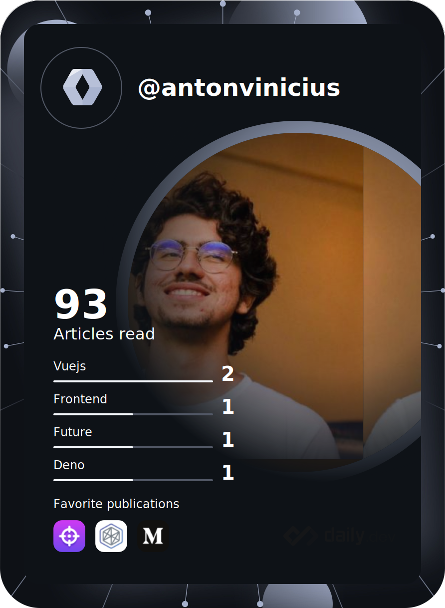

## Hello World 👋
<b>Meu nome é Antônio Vinícius</b> - Desenvolvedor Full Stack JS. Sou apaixonado por programação, principalmente por JavaScript e suas tecnologias. Trabalho com projetos pessoais, freelancer e para empresas. Uso este github como portfólio e projetos de estudo.
## Tecnologias

##

